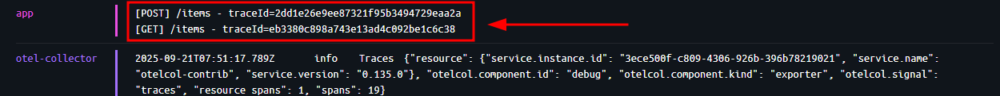
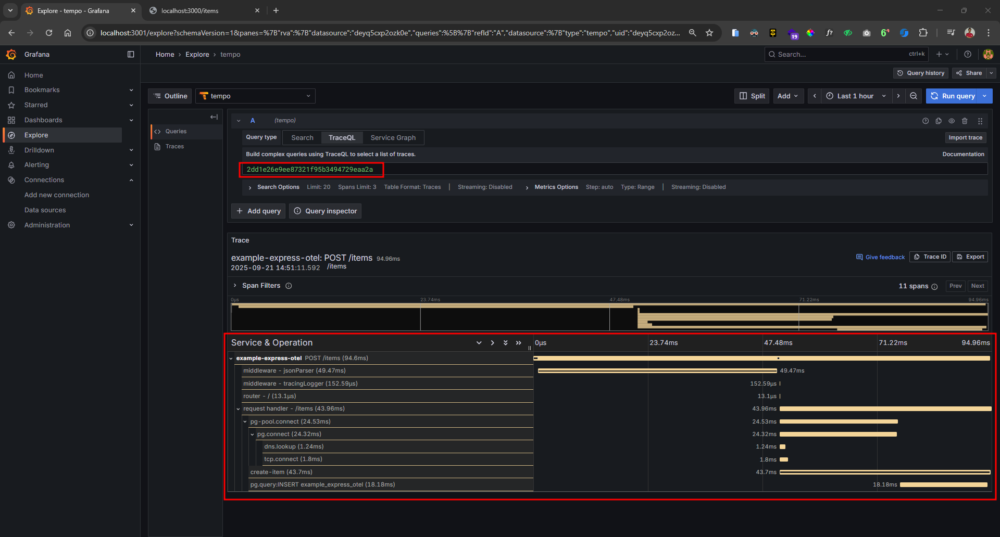

<h1 align="center">Example Express OTEL</h1>

<div align="center">

&nbsp;
&nbsp;
&nbsp;
&nbsp;
&nbsp;
&nbsp;
&nbsp;
&nbsp;

</div>

<p align="center">A sample Node.js Express application instrumented with <code>OpenTelemetry</code>, integrated with <code>Language SDK</code>, <code>Grafana Tempo</code>, <code>Grafana</code>, and <code>PostgreSQL</code>, running with Docker Compose.</p>

---

## Table of Contents

-   [Features](#features)
-   [Requirements](#requirements)
-   [Project Structure](#project-structure)
-   [Docker Setup](#docker-setup)
-   [Running the Application](#running-the-application)
-   [Open Telemetry Integration](#open-telemetry-integration)

---

## Features

-   Express.js REST API with TypeScript
-   OpenTelemetry tracing
-   OTLP export to Tempo
-   Tempo HTTP API for trace queries
-   Grafana for visualization
-   PostgreSQL database

---

## Requirements

-   Docker
-   Docker Compose
-   Node.js (for local dev if needed)

---

## Project Structure

```bash
.
├── Dockerfile
├── docker-compose.yaml
├── package.json
├── tsconfig.json
├── src/
│ │── middlewares
│ │──── tracingLogger.ts
│ │── routes
│ │──── items.ts
│ │── app.ts
│ │── db.ts
│ │── server.ts
│ └── tracing.ts
├── otel-collector-config.yaml
├── tempo-config.yaml
├── init.sql
├── init-grafana.sql
├── bruno
└── assets
```

## Docker Setup

### Running the Application

1. Clone this repository

```bash
git clone https://github.com/armandwipangestu/example-express-otel
cd example-express-otel
```

2. Run the application using docker compose

```bash
docker compose up -d
```

3. Setup Grafana

-   Login to Grafana dashboard at `http://localhost:3001`, and login using default user pass `admin`:`admin`
-   Add data source tempo with URL `http://tempo:3200`

4. Trying to monitor trace

-   Try to access the endpoint express with URL `http://localhost:3000/items` or you can create item using HTTP POST method (see the bruno example)
-   See the log, the request will have the `Trace ID`, example

Example log:



-   Now access the grafana dashboard and access the `Explore` menu then try to enter the Trace ID



## Open Telemetry Integration

Open Telemetry can export data `trace`, `log`, and `metric`, then can be integrated to backend server like `Grafana Tempo`, `Loki`, `Prometheus` or `Grafana Mimir`. To visualize the data can using `Grafana Dashboard`.


