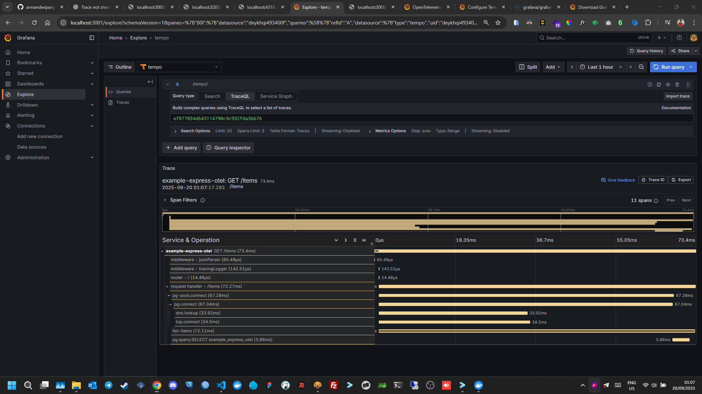
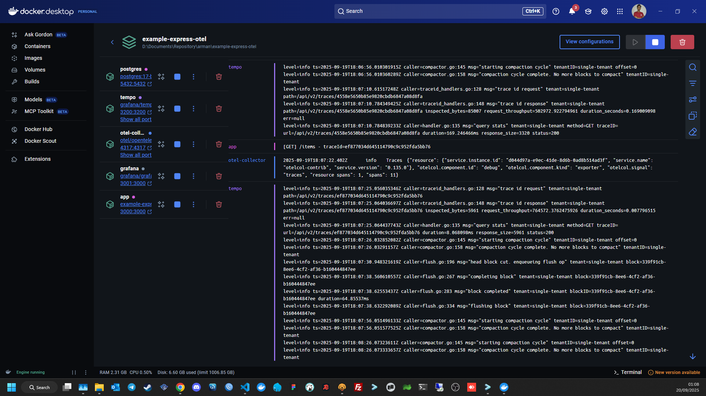
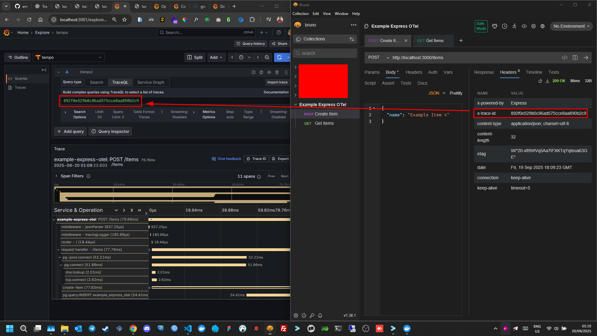

# Example Express OTEL

A sample Node.js Express application instrumented with `OpenTelemetry`, integrated with `Language SDK`, `Grafana Tempo`, `Grafana`, and `PostgreSQL`, running with Docker Compose.

---

## Table of Contents

-   [Features](#features)
-   [Requirements](#requirements)
-   [Project Structure](#project-structure)
-   [Docker Setup](#docker-setup)
-   [Running the Application](#running-the-application)
-   [OTEL & Tempo](#otel--tempo)
-   [Grafana](#grafana)
-   [Development](#development)
-   [Troubleshooting](#troubleshooting)

---

## Features

-   Express.js REST API with TypeScript
-   OpenTelemetry tracing
-   OTLP export to Tempo
-   Tempo HTTP API for trace queries
-   Grafana for visualization
-   PostgreSQL database

---

## Requirements

-   Docker
-   Docker Compose
-   Node.js (for local dev if needed)

---

## Project Structure

```bash
.
├── Dockerfile
├── docker-compose.yaml
├── package.json
├── tsconfig.json
├── src/
│ │── middlewares
│ │──── tracingLogger.ts
│ │── routes
│ │──── items.ts
│ │── app.ts
│ │── db.ts
│ │── server.ts
│ └── tracing.ts
├── otel-collector-config.yaml
├── tempo-config.yaml
├── init.sql
├── init-grafana.sql
├── bruno
└── assets
```

## Docker Setup

### Start Container

```bash
docker compose up -d
```

### Running the Application

After docker compose up, the app is accessible at:

```bash
http://localhost:3000
```

Example endpoint:

```bash
POST /items
GET /items
```

## Open Telemetry Integration


## Screenshot

1. Grafana Dashboard



2. Docker Desktop Log



3. Grafana Dashboard + Bruno


